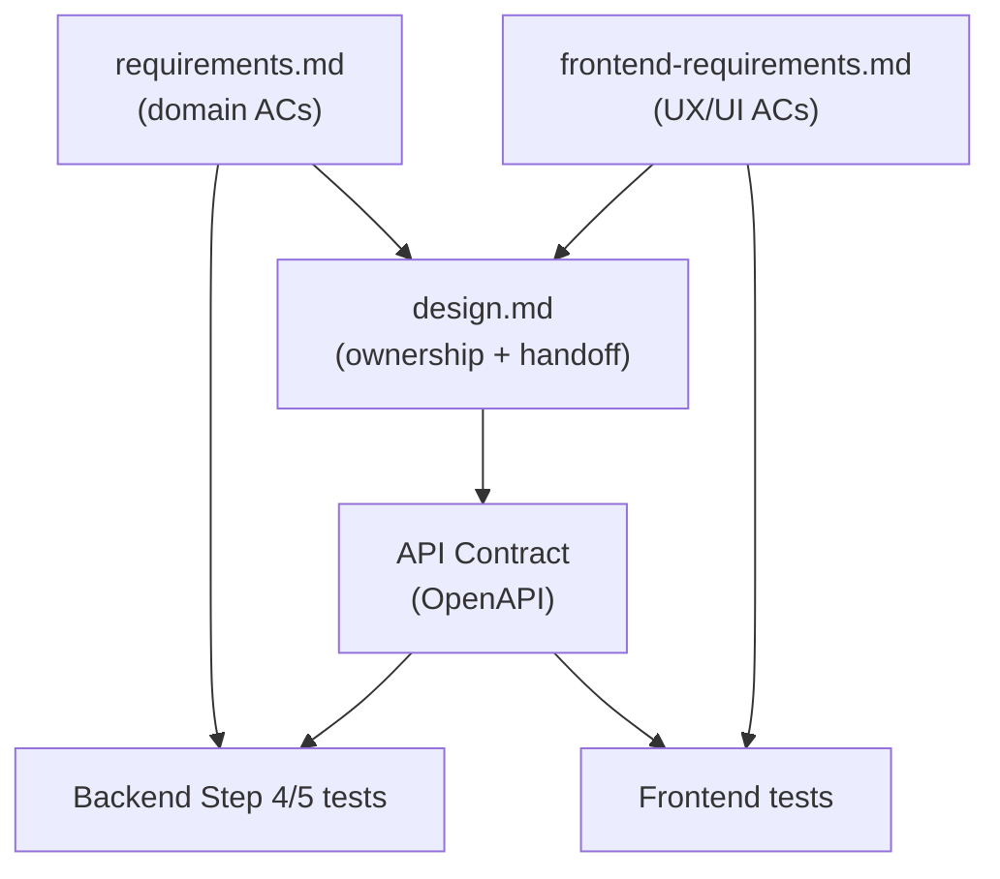

# Frontend SDD Extension Guide

## Overview

This document extends the normal SDD process in `docs/sdd-process.md` for frontend-owned Tateca surfaces.
Backend SDD remains the source of truth for domain behavior, backend API Contract, and backend test ownership.
Frontend SDD adds consumer-facing UX/UI behavior without duplicating domain ACs.

Use this document only when a Tateca feature has a frontend-owned surface. Backend-only, internal API-only, scheduled, or recovery-only changes do not need frontend SDD artifacts.

## Artifact Model

Use a three-layer model per feature:

| Artifact | Owner | Purpose |
|----------|-------|---------|
| `requirements.md` | Product / backend SDD | Canonical domain ACs and business outcomes |
| `frontend-requirements.md` | Frontend owner | UX/UI ACs: interaction, display state, messaging, navigation |
| `design.md` | Shared routing doc | Domain AC ownership matrix + Frontend AC ownership matrix + contract dependencies |

Additional frontend-facing contracts:

| Artifact | Owner | Purpose |
|----------|-------|---------|
| Tateca API Contract under `openapi/` | Tateca Backend | Published API Contract consumed by clients |
| Frontend implementation docs or tests | Frontend owner | UI behavior and user journey verification |

## Process Flow



## When To Add `frontend-requirements.md`

Add frontend requirements when a feature has a frontend-owned surface and at least one of the following is true:

- User-visible state changes
- User-visible messaging or amount display
- Input collection or submission guard behavior
- Navigation or refresh behavior after API response
- Error presentation mapped from API responses

Do not add frontend requirements for backend-only behavior unless a frontend surface is introduced later.

## Authoring Rules

- Keep domain outcomes in `requirements.md`. Do not restate backend business rules in frontend ACs.
- Reference domain AC IDs when frontend behavior depends on a domain branch.
- Put HTTP status, error code, and field validation in API Contract, not in frontend AC prose.
- Put button labels, layout, and visual styling in frontend-owned design artifacts or the frontend repo; `frontend-requirements.md` defines behavior, not pixel design.
- Use `design.md` to record which repo owns verification for each frontend AC and which API fields or errors the frontend consumes.

## Template And Testing

- Template: `docs/frontend-requirements-template.md`
- Frontend test policy: `docs/frontend-testing.md`
- Backend test policy remains in `docs/testing.md`

## Feature Layout

```
docs/specs/{feature}/
├── requirements.md              # domain ACs
├── frontend-requirements.md     # UX/UI ACs, when applicable
├── design.md                    # domain + frontend ownership routing
└── reviews/
    └── YYYY-MM-DD-frontend-requirements-review.md

openapi/                       # API Contract source files
└── paths/
    └── {feature}.yaml
```
