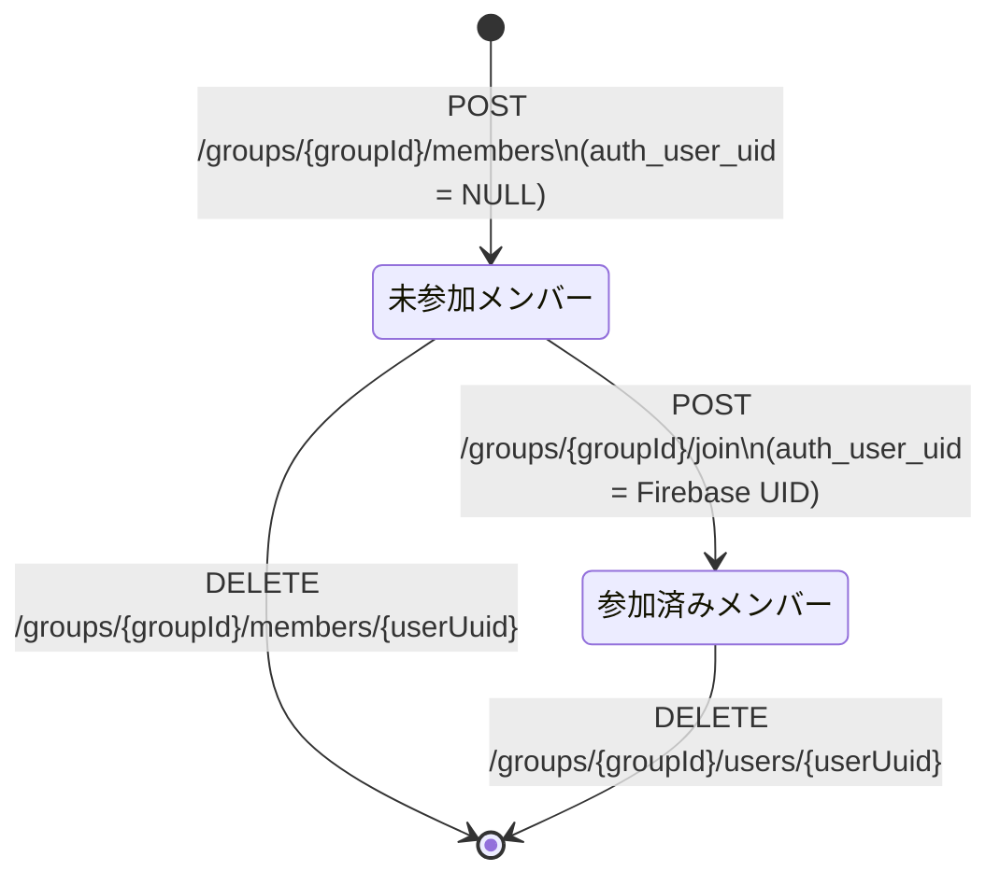

# Design Document (HLD) — メンバー追加 (add-member)

## Step 2 Scope and Ownership Rules

- `design.md` は QA が実装コードを逆引きせずに E2E テストを書くために十分な情報を提供する。すべての主要フローノードは MySQL の変化・変化しないものを記述する。
- QA ツーリングエンベロープ: `restClient`（HTTP）、`dbClient`（MySQL シード・アサーション）。本フィーチャーに外部スタブ（WireMock）は不要。
- オーナーシップルール: QA ツーリングエンベロープで再現可能なブランチは QA マトリクスに入れる。プロダクト内部の失敗注入が必要なブランチは開発者マトリクスに移す。
- 共有シナリオルール: 共有ビジネスシナリオは一度だけ書き、QA E2E（ステージング）と開発者 Testcontainers ローカルの両方で再利用する。
- QA が所有するシナリオは `AM-S01..AM-S05`、開発者専用の具体的シナリオは `AM-S06` から続ける。

## Test Asset Shape

- 共有シナリオセット: `AM-S01..AM-S05`
- QA セルフサービス E2E スイート: ステージングで上記シナリオを実行
- QA セルフサービスコントラクトスイート: HTTP エラーケースを `GroupControllerWebTest` に対応するステージング検証として実行
- 開発者ローカルセーフティネット: `AddMemberScenarioTest`（Testcontainers + MockMvc）、`GroupServiceUnitTest`、`GroupServiceIntegrationTest`

## AC Ownership Matrix

| Requirement / AC | Business trigger | Primary owner repo | Supporting repo(s) | Verification entrypoint | Contract / interface | Test owner |
|------------------|------------------|--------------------|--------------------|-------------------------|----------------------|------------|
| R1-AC1 | 認証済みメンバーがメンバー名を指定して POST | tateca-backend | — | `POST /groups/{groupId}/members` | Tateca API | tateca-backend |
| R1-AC2 | メンバー追加完了後にグループ情報確認 | tateca-backend | — | `GET /groups/{groupId}` | Tateca API | tateca-backend |
| R1-AC3 | メンバー追加完了後にメンバー数確認 | tateca-backend | — | `GET /groups/{groupId}` | Tateca API | tateca-backend |
| R1-AC4 | 同名メンバーが存在する状態で同名を追加 | tateca-backend | — | `POST /groups/{groupId}/members` | Tateca API | tateca-backend |
| R2-AC1 | 不正入力でメンバー追加リクエスト送信 | tateca-backend | — | `POST /groups/{groupId}/members` | Tateca API (Bean Validation) | tateca-backend |
| R3-AC1 | グループが 10 名のときにメンバー追加リクエスト | tateca-backend | — | `POST /groups/{groupId}/members` | Tateca API | tateca-backend |
| R4-AC1 | グループ外ユーザーがメンバー追加リクエスト | tateca-backend | — | `POST /groups/{groupId}/members` | Tateca API | tateca-backend |
| R5-AC1 | 存在しない groupId でメンバー追加リクエスト | tateca-backend | — | `POST /groups/{groupId}/members` | Tateca API | tateca-backend |

## Contract Dependency Order and Step Routing

1. Tateca API Contract（本リポジトリ `contracts/paths/groups-groupId-members.yaml`）がこのフィーチャーの唯一の API 境界を定義する。
2. Step 3 オーナー: tateca-workspace（本リポジトリ）
3. Step 4 オーナー: tateca-backend（`AddMemberScenarioTest`、`GroupControllerWebTest`）

## Canonical Testable Flows

### Request Flow

Convention: HTTP status codes appear only on terminal response nodes. Intermediate nodes describe DB side effects only.

```mermaid
flowchart TD
    A[POST /groups/{groupId}/members\nBearer JWT + member_name] --> B{Bean Validation\nmember_name: notBlank, max 50\ngroupId: UUID形式}
    B -- 無効 --> T1[400 Bad Request\nVALIDATION.FAILED]
    B -- 有効 --> C{Content-Type\napplication/json?}
    C -- 欠落 --> T2[415 Unsupported Media Type\nREQUEST.UNSUPPORTED_MEDIA_TYPE]
    C -- OK --> D{Firebase JWT\n認証}
    D -- 無効/欠落 --> T3[401 Unauthorized\nAUTH.INVALID_TOKEN]
    D -- OK --> E[Step1: user_groups を groupId で取得\nDB: SELECT user_groups + users JOIN\nDB変化なし]
    E --> F{グループ存在確認\nuser_groups が空?}
    F -- 空 --> T4[404 Not Found\nGROUP.NOT_FOUND]
    F -- 非空 --> G{認可チェック\n要求者の uid が\n認証済みメンバーに存在?}
    G -- 存在しない --> T5[403 Forbidden\nUSER.NOT_GROUP_MEMBER]
    G -- 存在する --> H{グループサイズチェック\nuser_groups.size >= 10?}
    H -- 上限到達 --> T6[409 Conflict\nGROUP.MAX_SIZE_REACHED]
    H -- 上限未満 --> I[Step2: 新規 UserEntity 永続化\nDB: users INSERT\n  uuid=新規UUID, name=member_name, auth_user_uid=NULL\n  created_at=CURRENT_TIMESTAMP]
    I --> J[Step3: UserGroupEntity 永続化\nDB: user_groups INSERT\n  user_uuid=Step2で生成したuuid\n  group_uuid=groupId]
    J --> T7[200 OK\nGroupResponse\n全メンバー一覧 + グループ情報 + transaction_count]
```

**明示的な非ゲート:**
- 同名メンバーの重複チェックは存在しない。同名メンバーの追加は常に許可される（R1-AC4）。
- `users` テーブルに `name` の一意制約は存在しない。

## State Model

メンバー追加によって影響を受ける状態は以下の2種類のみ。



未参加メンバー: `users.auth_user_uid = NULL`
参加済みメンバー: `users.auth_user_uid` に Firebase UID が設定された状態

## External Integration Flows

本フィーチャーに外部 API 依存はない。Firebase JWT 検証はリクエストフィルター層（`TatecaAuthFilter`）で行われ、このサービスメソッドに到達する時点では認証済みであることが保証されている。

## Assertion Rules For Test Authors

- **未参加メンバーの定義:** 追加されたメンバーの `users.auth_user_uid` は `NULL` でなければならない。レスポンス上では `UserResponse.auth_user` フィールドが `null` になる。
- **Step2 と Step3 のアトミック性:** `users` INSERT と `user_groups` INSERT は同一 `@Transactional` スコープで実行される。どちらか一方が失敗した場合、両方がロールバックされる。
- **メンバー数カウント:** グループサイズは `user_groups.count(group_uuid = groupId)` で判定される。認証済みメンバーと未参加メンバーの両方がカウントに含まれる。
- **グループ不存在の判定:** `user_groups` テーブルが指定 `groupId` に対して0件の場合、`GROUP.NOT_FOUND` として扱う（グループが存在しても全メンバーが削除された状態は現在の実装では不可能のため、この条件はグループ不存在と等価）。
- **認可チェック:** `users.auth_user_uid = uid` が `user_groups` に存在するメンバーのみが追加操作を許可される。未参加メンバー（`auth_user_uid = NULL`）は認可チェックを通過できない。
- **レスポンスのメンバー一覧:** レスポンスに含まれる `users` リストは、追加前の全メンバー + 新規追加メンバーを含む（追加後の全体像）。
- **外部サービスエラー変換ルール:** 本フィーチャーに外部サービス連携はないため、外部→内部エラー変換ルールは存在しない。
- **post-success ロールバック:** 外部 API 依存がないため、外部成功後のロールバックシナリオは存在しない。
- **バージョニング列:** `users` テーブルおよび `user_groups` テーブルに `version` 列は存在しない。楽観ロックは本フィーチャーに適用されない。

## QA E2E Matrix

| QA E2E method | Source | Staging prerequisite or harness | Response checks | MySQL checks |
|---------------|--------|---------------------------------|-----------------|----------------|--------------|
| `addMember_shouldAddNewUnjoinedMember` | AM-S01 / R1-AC1 / `200` | 認証済みメンバーが存在するグループをシード | `200`、レスポンスに新メンバーが含まれる | `users` に `auth_user_uid=NULL` の行が追加された、`user_groups` に新行が追加された | なし |
| `addMember_shouldIncludeAddedMemberAsUnjoined` | AM-S02 / R1-AC2 / `200` | 同上 | グループ取得時に追加メンバーの `auth_user=null` | `users.auth_user_uid IS NULL` | なし |
| `addMember_shouldIncreaseMemberCountBy1` | AM-S03 / R1-AC3 / `200` | 同上 | レスポンスの `users` 配列が追加前+1 | `user_groups` の件数が+1 | なし |
| `addMember_shouldAllowDuplicateName` | AM-S04 / R1-AC4 / `200` | 同名メンバーが既存のグループをシード | `200`、同名が2件含まれる | `users` に同名の行が2件存在 | なし |
| `addMember_shouldRejectWhenGroupAtMaxSize` | AM-S05 / R3-AC1 / `409` | 10名のグループをシード | `409`、`error_code=GROUP.MAX_SIZE_REACHED` | ビジネス書き込みなし | なし |

## QA Contract E2E Matrix

| QA contract E2E method | Source | Staging prerequisite or harness | Response checks | MySQL checks |
|------------------------|--------|---------------------------------|-----------------|----------------|--------------|
| `addMember_shouldReturn400WhenMemberNameIsBlank` | R2-AC1 / `400` / `VALIDATION.FAILED` | 任意の有効グループ | `400`、`error_code=VALIDATION.FAILED`、`errors` フィールドあり | ビジネス書き込みなし | なし |
| `addMember_shouldReturn400WhenMemberNameTooLong` | R2-AC1 / `400` / `VALIDATION.FAILED` | 同上 | `400`、`error_code=VALIDATION.FAILED` | ビジネス書き込みなし | なし |
| `addMember_shouldReturn400WhenInvalidGroupId` | R2-AC1 / `400` | UUID 形式でない groupId | `400` | ビジネス書き込みなし | なし |
| `addMember_shouldReturn401WhenNoToken` | 認証前提条件 / `401` | — | `401` | ビジネス書き込みなし | なし |
| `addMember_shouldReturn403WhenNotGroupMember` | R4-AC1 / `403` / `USER.NOT_GROUP_MEMBER` | グループ外ユーザーで認証 | `403`、`error_code=USER.NOT_GROUP_MEMBER` | ビジネス書き込みなし | なし |
| `addMember_shouldReturn404WhenGroupNotFound` | R5-AC1 / `404` / `GROUP.NOT_FOUND` | 存在しない groupId | `404`、`error_code=GROUP.NOT_FOUND` | ビジネス書き込みなし | なし |
| `addMember_shouldReturn415WhenNoContentType` | `415` / `REQUEST.UNSUPPORTED_MEDIA_TYPE` | — | `415` | ビジネス書き込みなし | なし |

## Developer Verification Policy

### Shared Scenario Mirroring

QA E2E マトリクスが共有ビジネス動作の唯一の正規シナリオマトリクスである。QA が所有するすべての共有シナリオ（AM-S01..AM-S05）は Testcontainers + MockMvc を使用してローカルでも実行可能であり、同じレスポンス・MySQL アウトカムを証明しなければならない。これは `AddMemberScenarioTest` が担う。

### Dev-Only Verification

| Scenario ID | Verification item | Why it is developer-owned | Expected local proof |
|-------------|-------------------|---------------------------|----------------------|
| AM-S06 | `users` INSERT 成功・`user_groups` INSERT 成功のアトミック性（ロールバック確認） | DB 障害注入が必要 | `GroupServiceIntegrationTest` でトランザクション境界を確認 |
| — | 全 OpenAPI エラーコードのマッピング網羅（`VALIDATION.FAILED`・`REQUEST.MALFORMED_JSON`・`REQUEST.UNSUPPORTED_MEDIA_TYPE` など） | Bean Validation と ExceptionHandler のマッピングは Controller Web Test で証明済み。QA は staging で再現可能だが、網羅的な variant は開発者が管理 | `GroupControllerWebTest` |
| — | `GroupServiceImpl.addMember` の各ブランチ（GROUP_NOT_FOUND・USER_NOT_GROUP_MEMBER・GROUP_MAX_SIZE_REACHED）の例外スロー確認 | モック注入が必要 | `GroupServiceUnitTest` |

### Local Proof Selection Rule

- **共有シナリオ（AM-S01..AM-S05）:** `AddMemberScenarioTest`（Testcontainers + MockMvc）— 最も軽量なフル統合証明
- **コントラクト・バリデーション・エラーマッピング:** `GroupControllerWebTest`（`@WebMvcTest`）
- **ドメインロジック分岐:** `GroupServiceUnitTest`（Mockito）
- **DB 永続化・トランザクション境界:** `GroupServiceIntegrationTest`（Testcontainers）

## Data Model Decisions

- `users` テーブルに `auth_user_uid = NULL` で INSERT することで「未参加メンバー」を表現する。これは `join-group` フィーチャーで後から UID を紐付けるための設計。
- `user_groups` は (`user_uuid`, `group_uuid`) の複合主キーを持ち、同一ユーザーの同一グループへの重複参加を防止する。ただし `name` レベルの一意制約はなく、同名ユーザーは複数存在できる。
- `users.name` は `varchar(50)` で、文字数上限は Bean Validation（`@Size(max=50)`）と DB スキーマ制約の両方で保証される。
