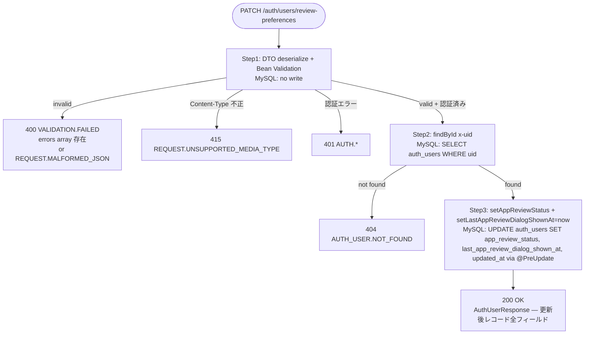
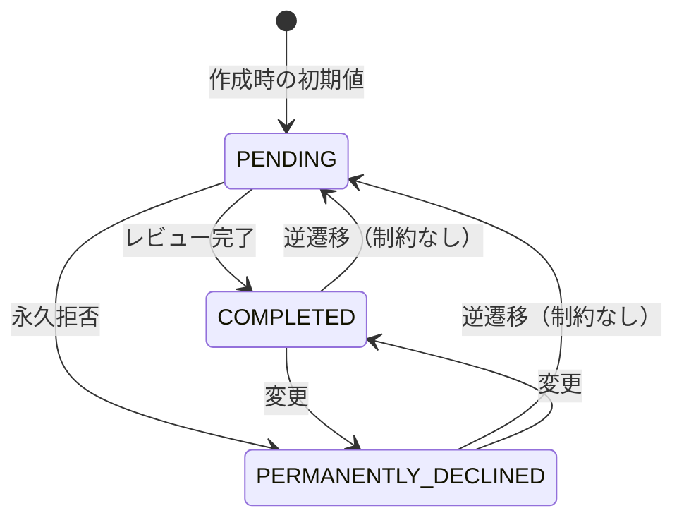

# Design Document (HLD) — auth-user

## Step 2 Scope and Ownership Rules

- `design.md` は QA が E2E テストを記述するための唯一の HLD 情報源である。すべての主要フローノードは MySQL の変化と変化しない項目を明記する。
- QA ツールエンベロープ: HTTP クライアント（`restClient`）、DB クライアント（`dbClient`）、ステージング環境。外部依存なし（`AuthUserServiceImpl` は外部 API を呼ばない）。
- QA が担当するブランチ: QA ツールエンベロープで再現可能なブランチ（正常作成・初期値確認・重複拒否・取得・ログイン記録更新・削除・紐付け解除・レビュー更新・各種バリデーション）はすべて QA マトリクスに配置する。
- 開発者専用ブランチ: プロダクト内部の失敗注入（JPA ライフサイクル・DB 制約など）が必要なブランチは開発者マトリクスに移動する。
- 共有シナリオルール: 共有ビジネスシナリオは1回だけ定義し、QA E2E（ステージング）と開発者 Testcontainers ローカルで再利用する。
- QA は `AU-S01..AU-S08` を所有する。開発者専用具体的シナリオは `AU-S09` から続ける。

## Test Asset Shape

- 共有シナリオセット: `AuthUserScenariosTests`（interface）— 現在は操作別 ScenarioTest（旧形式）が代替
- QA 自己サービス E2E スイート: E2E executor（ステージング用、別 PR で対応）
- 開発者ローカルセーフティネット: `CreateAuthUserScenarioTest` / `GetAuthUserScenarioTest` / `DeleteAuthUserScenarioTest`（Testcontainers + MockMvc）、`AuthUserServiceUnitTest`、`AuthUserServiceIntegrationTest`

## AC Ownership Matrix

| Requirement / AC | Business trigger | Primary owner repo | Verification entrypoint | Contract / interface | Test owner |
|------------------|------------------|--------------------|-------------------------|----------------------|------------|
| R1-AC1 | 未登録メールで認証ユーザー作成を要求 | tateca-backend | `POST /auth/users` + `GET /auth/users/{uid}` | `auth-users.yaml` | tateca-backend |
| R1-AC2 | 作成後に初期値を確認 | tateca-backend | `POST /auth/users` レスポンス | `auth-users.yaml` | tateca-backend |
| R1-AC3 | 作成後に最終ログイン日時を確認 | tateca-backend | `POST /auth/users` レスポンス | `auth-users.yaml` | tateca-backend |
| R2-AC1 | 不正入力で作成を要求 | tateca-backend | `POST /auth/users` 400 レスポンス | `auth-users.yaml` | tateca-backend |
| R3-AC1 | 既登録メールで作成を要求 | tateca-backend | `POST /auth/users` 409 レスポンス | `auth-users.yaml` | tateca-backend |
| R4-AC1 | 存在する UID で情報取得を要求 | tateca-backend | `GET /auth/users/{uid}` | `auth-users-uid.yaml` | tateca-backend |
| R4-AC2 | 取得時のログイン記録更新を確認 | tateca-backend | `GET /auth/users/{uid}` レスポンス | `auth-users-uid.yaml` | tateca-backend |
| R4-AC3 | 複数回取得でログイン回数累積を確認 | tateca-backend | `GET /auth/users/{uid}` レスポンス | `auth-users-uid.yaml` | tateca-backend |
| R5-AC1 | 不正入力で取得または削除を要求 | tateca-backend | `GET /auth/users/{uid}` / `DELETE /auth/users/{uid}` 400 レスポンス | `auth-users-uid.yaml` | tateca-backend |
| R6-AC1 | 存在する UID で削除を要求 | tateca-backend | `DELETE /auth/users/{uid}` + `GET /auth/users/{uid}` 404 確認 | `auth-users-uid.yaml` | tateca-backend |
| R6-AC2 | 削除前の紐付け解除を確認 | tateca-backend | `DELETE /auth/users/{uid}` + DB 確認 | `auth-users-uid.yaml` | tateca-backend |
| R6-AC3 | 削除後のアプリ内ユーザー保持を確認 | tateca-backend | `DELETE /auth/users/{uid}` + DB 確認 | `auth-users-uid.yaml` | tateca-backend |
| R7-AC1 | 存在しない UID で取得を要求 | tateca-backend | `GET /auth/users/{uid}` 404 レスポンス | `auth-users-uid.yaml` | tateca-backend |
| R7-AC2 | 存在しない UID で削除を要求 | tateca-backend | `DELETE /auth/users/{uid}` 404 レスポンス | `auth-users-uid.yaml` | tateca-backend |
| R7-AC3 | 対応レコードなしでレビュー更新を要求 | tateca-backend | `PATCH /auth/users/review-preferences` 404 レスポンス | `auth-users-review-preferences.yaml` | tateca-backend |
| R8-AC1 | 有効なステータスでレビュー更新を要求 | tateca-backend | `PATCH /auth/users/review-preferences` | `auth-users-review-preferences.yaml` | tateca-backend |
| R8-AC2 | 更新後のダイアログ表示日時を確認 | tateca-backend | `PATCH /auth/users/review-preferences` レスポンス | `auth-users-review-preferences.yaml` | tateca-backend |
| R8-AC3 | 任意のステータスへの遷移を確認 | tateca-backend | `PATCH /auth/users/review-preferences` | `auth-users-review-preferences.yaml` | tateca-backend |
| R9-AC1 | 不正入力でレビュー更新を要求 | tateca-backend | `PATCH /auth/users/review-preferences` 400 レスポンス | `auth-users-review-preferences.yaml` | tateca-backend |

## Contract Dependency Order and Step Routing

1. tateca-backend が `contracts/paths/auth-users.yaml` / `auth-users-uid.yaml` / `auth-users-review-preferences.yaml` を所有し固定する
2. Step 3 (black-box tests) オーナー: tateca-backend（`AuthUserScenariosTests`、`AuthUserControllerWebTest`）
3. Step 4 (internal tests) オーナー: tateca-backend（`AuthUserServiceUnitTest`、`AuthUserServiceIntegrationTest`）

## Canonical Testable Flows

### POST /auth/users — 認証ユーザー作成フロー

Convention: HTTP status codes appear only on terminal response nodes. Intermediate nodes describe DB side effects only.

```mermaid
flowchart TD
    A([POST /auth/users]) --> B[Step1: DTO deserialize + Bean Validation\nMySQL: no write]
    B -->|invalid| T400[400 VALIDATION.FAILED\nerrors array 存在\nor REQUEST.MALFORMED_JSON\nerrors array 不在]
    B -->|Content-Type 不正| T415[415 REQUEST.UNSUPPORTED_MEDIA_TYPE]
    B -->|認証情報なし| T401A[401 AUTH.MISSING_CREDENTIALS]
    B -->|Bearer 形式不正| T401B[401 AUTH.INVALID_FORMAT]
    B -->|トークン無効| T401C[401 AUTH.INVALID_TOKEN]
    B -->|valid + 認証済み| C[Step2: existsByEmail チェック\nMySQL: SELECT auth_users WHERE email]
    C -->|already exists| T409[409 AUTH_USER.EMAIL_DUPLICATE]
    C -->|not exists| D[Step3: AuthUserEntity build\nuid=x-uid, name='', email\nlastLoginTime=now(), totalLoginCount=1\nappReviewStatus=PENDING\nMySQL: no write yet]
    D --> E[Step4: repository.save\nMySQL: INSERT INTO auth_users\ncreatedAt/updatedAt set by @PrePersist]
    E --> T201[201 Created\nAuthUserResponse — 作成レコード全フィールド]
```

### GET /auth/users/{uid} — 認証ユーザー取得フロー

Convention: HTTP status codes appear only on terminal response nodes. Intermediate nodes describe DB side effects only.

```mermaid
flowchart TD
    A([GET /auth/users/{uid}]) --> B[Step1: パスパラメータ Bean Validation\nMySQL: no write]
    B -->|invalid| T400[400 VALIDATION.FAILED\nerrors array 存在]
    B -->|認証エラー| T401[401 AUTH.*]
    B -->|valid + 認証済み| C[Step2: findById uid\nMySQL: SELECT auth_users WHERE uid]
    C -->|not found| T404[404 AUTH_USER.NOT_FOUND]
    C -->|found| D[Step3: loginCount+1, lastLoginTime=now\nMySQL: UPDATE auth_users SET total_login_count, last_login_time, updated_at via @PreUpdate]
    D --> T200[200 OK\nAuthUserResponse — 更新後レコード全フィールド]
```

### DELETE /auth/users/{uid} — 認証ユーザー削除フロー

Convention: HTTP status codes appear only on terminal response nodes. Intermediate nodes describe DB side effects only.

```mermaid
flowchart TD
    A([DELETE /auth/users/{uid}]) --> B[Step1: パスパラメータ Bean Validation\nMySQL: no write]
    B -->|invalid| T400[400 VALIDATION.FAILED\nerrors array 存在]
    B -->|認証エラー| T401[401 AUTH.*]
    B -->|valid + 認証済み| C[Step2: findById uid\nMySQL: SELECT auth_users WHERE uid]
    C -->|not found| T404[404 AUTH_USER.NOT_FOUND]
    C -->|found| D[Step3: findByAuthUserUid + setAuthUser null\nMySQL: UPDATE users SET auth_user_uid = NULL for all linked users]
    D --> E[Step4: deleteById uid\nMySQL: DELETE FROM auth_users WHERE uid]
    E --> T204[204 No Content]
```

### PATCH /auth/users/review-preferences — レビュー設定更新フロー

Convention: HTTP status codes appear only on terminal response nodes. Intermediate nodes describe DB side effects only.



**Non-gate note:** いずれのフローにも在庫チェック・残高確認・in-flight ゲートは存在しない。認証フィルターは `TatecaAuthenticationFilter` が処理し、コントローラー到達前に 401 を返す。ステータス遷移制約（例: COMPLETED → PENDING の逆遷移禁止）は存在しない。

## External Integration Flows

本フィーチャーは外部 API 呼び出しを行わない。Firebase 認証は `TatecaAuthenticationFilter`（リクエストフィルター）が担当し、`AuthUserServiceImpl` は呼ばない。MySQL（`auth_users` テーブル・`users` テーブル）のみを使用する。

## State Model

`auth_users.app_review_status` は以下の状態を持つ。遷移制約なし（任意方向に変更可能）。



## Assertion Rules For Test Authors

- **作成時初期値:** `name=""`, `totalLoginCount=1`, `appReviewStatus=PENDING`, `lastLoginTime=Instant.now()` がビルダーで明示的に設定される。`createdAt` / `updatedAt` は `@PrePersist` が設定する。テストは `POST /auth/users` レスポンスでこれらを直接アサートできる。
- **`lastLoginTime` の精度:** `lastLoginTime` は `Instant.now()` で設定されるため、E2E テストでは「非 null かつ非空文字」を確認する（厳密な時刻比較は非推奨）。
- **ログイン記録更新（GET）:** `GET /auth/users/{uid}` のたびに `totalLoginCount += 1`、`lastLoginTime = Instant.now()` が DB に保存される。`@PreUpdate` が `updatedAt` も更新する。累積加算は `AuthUserServiceIntegrationTest.shouldPersistIncrementedLoginCount` で証明済み。
- **削除の順序:** `deleteAuthUser` は ① `findById` で存在確認 → ② `findByAuthUserUid` で紐付くアプリ内ユーザーを取得 → ③ `setAuthUser(null)` + `saveAll` で紐付け解除 → ④ `deleteById` で認証ユーザー削除 の順で実行される。この順序はトランザクション内で保証される。
- **紐付け解除後のアプリ内ユーザー:** `users` テーブルのレコードは削除されず、`auth_user_uid` カラムが `NULL` になる。グループ・取引データは影響を受けない。
- **レビュー更新の同値更新:** 同じステータスへの更新でも `lastAppReviewDialogShownAt` と `updatedAt` は更新される（同値スキップなし）。
- **`@PreUpdate`:** `repository.save()` 呼び出し時に JPA `@PreUpdate` が `updatedAt = Instant.now()` を設定する。この振る舞いは `AuthUserServiceIntegrationTest` で証明する。
- **外部→内部エラー変換:** `GlobalExceptionHandler` が `MethodArgumentNotValidException` → `VALIDATION.FAILED`（400）、`ConstraintViolationException` → `VALIDATION.FAILED`（400）、`HttpMessageNotReadableException` → `REQUEST.MALFORMED_JSON`（400）、`HttpMediaTypeNotSupportedException` → `REQUEST.UNSUPPORTED_MEDIA_TYPE`（415）、`DuplicateResourceException` → `409`、`EntityNotFoundException` → `404` にマッピングする。これらは `AuthUserControllerWebTest` で証明する。
- **post-success rollback:** 本フィーチャーは外部 API を呼ばないため、外部 `2xx` 後のロールバックシナリオは存在しない。
- **versioned-row:** `auth_users` テーブルに `version` カラムは存在しない（楽観ロックは Out of Scope）。

## QA E2E Matrix

| QA E2E method | Source | Staging prerequisite or harness | Response checks | MySQL checks |
|---------------|--------|--------------------------------|-----------------|--------------|
| `auS01_r1Ac1_createAndVerify` | AU-S01 / R1-AC1 | なし | `201` / `$.uid` / `$.email` | `auth_users` レコード存在 via GET |
| `auS02_r1Ac2Ac3_initialValues` | AU-S02 / R1-AC2, R1-AC3 | なし | `201` / `$.total_login_count == 1` / `$.app_review_status == "PENDING"` / `$.last_login_time` 非 null | `auth_users.total_login_count == 1` / `app_review_status == 'PENDING'` |
| `auS03_r3Ac1_rejectDuplicateEmail` | AU-S03 / R3-AC1 | 同メールで先に1件作成 | `409` / `$.error_code == "AUTH_USER.EMAIL_DUPLICATE"` | no insert |
| `auS04_r4Ac1Ac2_getAndIncrementLogin` | AU-S04 / R4-AC1, R4-AC2 | 認証ユーザー作成済み | `200` / `$.total_login_count == 2` / `$.last_login_time` 非 null | `auth_users.total_login_count == 2` |
| `auS05_r4Ac3_cumulativeLoginCount` | AU-S05 / R4-AC3 | 認証ユーザー作成済み | 3回 GET 後 `$.total_login_count == 4` | `auth_users.total_login_count == 4` |
| `auS06_r6Ac1_deleteAndVerify` | AU-S06 / R6-AC1 | 認証ユーザー作成済み | `204` / 削除後 GET で `404` | `auth_users` レコード消滅 |
| `auS07_r6Ac2Ac3_unlinkAndPreserveAppUser` | AU-S07 / R6-AC2, R6-AC3 | 認証ユーザー + グループ作成済み | `204` | `users.auth_user_uid == NULL` / `users` レコード存在維持 |
| `auS08_r8Ac1Ac2_updateReviewStatus` | AU-S08 / R8-AC1, R8-AC2 | 認証ユーザー作成済み | `200` / `$.app_review_status == "COMPLETED"` / `$.last_app_review_dialog_shown_at` 非 null | `auth_users.app_review_status == 'COMPLETED'` |

## QA Contract E2E Matrix

| QA contract E2E method | Source | Staging prerequisite or harness | Response checks | MySQL checks |
|------------------------|--------|--------------------------------|-----------------|--------------|
| `shouldReturn400WhenEmailIsBlank` | R2-AC1 / `VALIDATION.FAILED` | なし | `400` / `$.error_code == "VALIDATION.FAILED"` / `$.errors` 存在 | no write |
| `shouldReturn400WhenEmailIsMissing` | R2-AC1 / `VALIDATION.FAILED` | なし | `400` / `$.error_code == "VALIDATION.FAILED"` | no write |
| `shouldReturn400WhenEmailExceeds255` | R2-AC1 / `VALIDATION.FAILED` | なし | `400` / `$.error_code == "VALIDATION.FAILED"` | no write |
| `shouldReturn400WhenMalformedJsonOnCreate` | `REQUEST.MALFORMED_JSON` | なし | `400` / `$.error_code == "REQUEST.MALFORMED_JSON"` | no write |
| `shouldReturn415WhenContentTypeMissingOnCreate` | `REQUEST.UNSUPPORTED_MEDIA_TYPE` | なし | `415` / `$.error_code == "REQUEST.UNSUPPORTED_MEDIA_TYPE"` | no write |
| `shouldReturn400WhenUidExceeds128OnGet` | R5-AC1 / `VALIDATION.FAILED` | なし | `400` / `$.errors` 存在 | no write |
| `shouldReturn404WhenNotFoundOnGet` | R7-AC1 / `AUTH_USER.NOT_FOUND` | なし | `404` / `$.error_code == "AUTH_USER.NOT_FOUND"` | no write |
| `shouldReturn400WhenUidExceeds128OnDelete` | R5-AC1 / `VALIDATION.FAILED` | なし | `400` / `$.errors` 存在 | no write |
| `shouldReturn404WhenNotFoundOnDelete` | R7-AC2 / `AUTH_USER.NOT_FOUND` | なし | `404` / `$.error_code == "AUTH_USER.NOT_FOUND"` | no write |
| `shouldReturn400WhenStatusIsNullOnReview` | R9-AC1 / `VALIDATION.FAILED` | 認証ユーザー作成済み | `400` / `$.error_code == "VALIDATION.FAILED"` | no write |
| `shouldReturn400WhenStatusIsInvalidEnumOnReview` | R9-AC1 / `REQUEST.MALFORMED_JSON` | 認証ユーザー作成済み | `400` / `$.error_code == "REQUEST.MALFORMED_JSON"` | no write |
| `shouldReturn415WhenContentTypeMissingOnReview` | `REQUEST.UNSUPPORTED_MEDIA_TYPE` | 認証ユーザー作成済み | `415` / `$.error_code == "REQUEST.UNSUPPORTED_MEDIA_TYPE"` | no write |
| `shouldReturn404WhenNotFoundOnReview` | R7-AC3 / `AUTH_USER.NOT_FOUND` | なし | `404` / `$.error_code == "AUTH_USER.NOT_FOUND"` | no write |

## Developer Verification Policy

### Shared Scenario Mirroring

QA E2E マトリクスが共有ビジネス動作の唯一の正規シナリオマトリクスである。QA が所有するすべての共有シナリオ（AU-S01..AU-S08）は Testcontainers + MockMvc を使用してローカルでも実行可能であり、同じレスポンス・MySQL アウトカムを証明しなければならない。

### Dev-Only Verification

| Scenario ID | Verification item | Why it is developer-owned | Expected local proof |
|-------------|-------------------|---------------------------|----------------------|
| — | `AuthUserServiceImpl` 各メソッドの分岐（EMAIL_DUPLICATE・NOT_FOUND・save 非呼び出しなど） | モック注入が必要 | `AuthUserServiceUnitTest` |
| — | JPA `@PrePersist` が `createdAt` / `updatedAt` を設定すること | 実 DB・JPA ライフサイクルが必要 | `AuthUserServiceIntegrationTest` |
| — | JPA `@PreUpdate` が `updatedAt` を更新すること（レビュー更新・ログイン記録更新） | 実 DB・JPA ライフサイクルが必要 | `AuthUserServiceIntegrationTest` |
| — | ログイン回数の累積永続化（複数 flush/clear を跨いだ加算） | 実 DB・複数トランザクションが必要 | `AuthUserServiceIntegrationTest` |
| — | 全 OpenAPI エラーコードのマッピング（`VALIDATION.FAILED` / `REQUEST.MALFORMED_JSON` / `REQUEST.UNSUPPORTED_MEDIA_TYPE` / `AUTH_USER.EMAIL_DUPLICATE` / `AUTH_USER.NOT_FOUND` など） | ExceptionHandler マッピングは Controller Web Test で網羅 | `AuthUserControllerWebTest` |

### Local Proof Selection Rule

- **共有シナリオ（AU-S01..AU-S08）:** `CreateAuthUserScenarioTest` / `GetAuthUserScenarioTest` / `DeleteAuthUserScenarioTest`（Testcontainers + MockMvc）
- **コントラクト・バリデーション・エラーマッピング:** `AuthUserControllerWebTest`（`@WebMvcTest`）
- **ドメインロジック分岐:** `AuthUserServiceUnitTest`（Mockito）
- **DB 永続化・JPA ライフサイクル:** `AuthUserServiceIntegrationTest`（Testcontainers）

## Data Model Decisions

- `auth_users` テーブルを使用。スキーマ変更なし。
- `uid`（PK）: Firebase UID。最大 128 文字。一意制約あり。
- `name`: 作成時は空文字（`""`）で初期化。グループ作成時にメンバー名として別途設定される。
- `email`: 一意制約あり（`unique = true`）。重複は `repository.existsByEmail()` でアプリ層チェック後に拒否する。トリム処理なし。
- `created_at` / `updated_at`: `@PrePersist` / `@PreUpdate` で自動設定。アプリ側からの直接セットは行わない。
- `last_login_time`: 作成時と `GET /auth/users/{uid}` 呼び出しのたびに `Instant.now()` で更新。
- `total_login_count`: 作成時に `1` で初期化。`GET /auth/users/{uid}` のたびに `+1`。
- `app_review_status`: `ENUM('PENDING', 'COMPLETED', 'PERMANENTLY_DECLINED')`。作成時は `PENDING`。遷移制約なし。
- `last_app_review_dialog_shown_at`: 作成時は `NULL`。`PATCH /auth/users/review-preferences` のたびに `Instant.now()` で更新。
- `users.auth_user_uid`: `auth_users` への外部キー。認証ユーザー削除時に `NULL` にセットされる（アプリ内ユーザーレコードは保持）。
