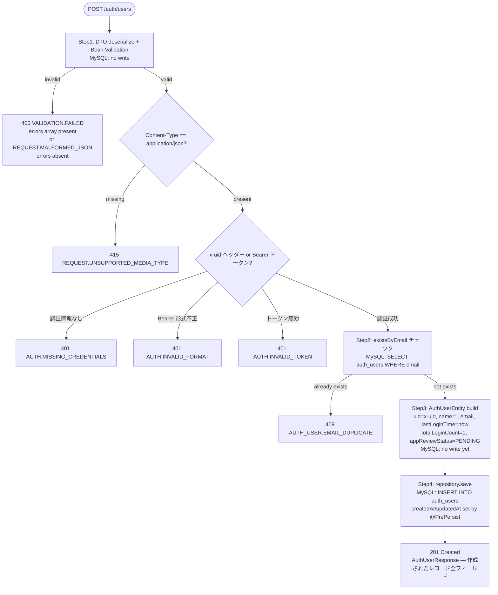

# Design Document (HLD) — create-auth-user

## Step 2 Scope and Ownership Rules

- `design.md` は QA が E2E テストを記述するための唯一の HLD 情報源である。すべての主要フローノードは MySQL の変化と変化しない項目を明記する。
- QA ツールエンベロープ: HTTP クライアント（`restClient`）、DB クライアント（`dbClient`）、ステージング環境。外部依存なし（`AuthUserServiceImpl` は外部 API を呼ばない）。
- QA が担当するブランチ: QA ツールエンベロープで再現可能なブランチ（正常作成・初期値確認・重複拒否・バリデーション）はすべて QA マトリクスに配置する。
- 開発者専用ブランチ: プロダクト内部の失敗注入が必要なブランチは開発者マトリクスに移動する。
- 共有シナリオルール: 共有ビジネスシナリオは1回だけ定義し、QA E2E（ステージング）と開発者 Testcontainers ローカルで再利用する。
- QA は `CAU-S01..CAU-S03` を所有する。開発者専用具体的シナリオは `CAU-S04` から続ける。

## Test Asset Shape

- 共有シナリオセット: `CreateAuthUserScenariosTests`（interface）— 現在は `CreateAuthUserScenarioTest`（旧形式）が代替
- QA 自己サービス E2E スイート: E2E executor（ステージング用、別 PR で対応）
- 開発者ローカルセーフティネット: `CreateAuthUserScenarioTest`（Testcontainers + MockMvc）、`AuthUserServiceUnitTest`、`AuthUserServiceIntegrationTest`

## AC Ownership Matrix

| Requirement / AC | Business trigger | Primary owner repo | Supporting repo(s) | Verification entrypoint | Contract / interface | Test owner |
|------------------|------------------|--------------------|--------------------|-------------------------|----------------------|------------|
| R1-AC1 | 未登録メールで認証ユーザー作成を要求 | tateca-backend | — | `POST /auth/users` + `GET /auth/users/{uid}` | `auth-users.yaml` | tateca-backend |
| R1-AC2 | 作成後に初期値を確認 | tateca-backend | — | `POST /auth/users` レスポンス | `auth-users.yaml` | tateca-backend |
| R1-AC3 | 作成後に最終ログイン日時を確認 | tateca-backend | — | `POST /auth/users` レスポンス | `auth-users.yaml` | tateca-backend |
| R2-AC1 | 不正入力（空・null・長さ超過など）を送信 | tateca-backend | — | `POST /auth/users` 400 レスポンス | `auth-users.yaml` | tateca-backend |
| R3-AC1 | 既登録メールアドレスで作成を要求 | tateca-backend | — | `POST /auth/users` 409 レスポンス | `auth-users.yaml` | tateca-backend |

## Contract Dependency Order and Step Routing

1. tateca-backend が `contracts/paths/auth-users.yaml` を所有し固定する
2. Step 3 (black-box tests) オーナー: tateca-backend（`CreateAuthUserScenariosTests`、`AuthUserControllerWebTest`）
3. Step 4 (internal tests) オーナー: tateca-backend（`AuthUserServiceUnitTest`、`AuthUserServiceIntegrationTest`）

## Canonical Testable Flows

### Request Flow

Convention: HTTP status codes appear only on terminal response nodes. Intermediate nodes describe DB side effects only.

**Non-gate note:** このフローには在庫チェック、残高確認、in-flight ゲートなどは存在しない。唯一のドメインゲートはメールアドレスの重複チェックである。認証フィルターは `TatecaAuthenticationFilter` が処理し、コントローラー到達前に 401 を返す。

## External Integration Flows

本フィーチャーは外部 API 呼び出しを行わない。Firebase 認証は `TatecaAuthenticationFilter`（リクエストフィルター）が担当し、`AuthUserServiceImpl` は呼ばない。MySQL（`auth_users` テーブル）のみを使用する。

## State Model

`auth_users` レコードは作成のみ（このフィーチャーのスコープ内）。削除は `delete-auth-user`、更新は `update-app-review` で対応。`app_review_status` は `PENDING` → `COMPLETED` / `PERMANENTLY_DECLINED` のライフサイクルを持つが、本フィーチャーでは `PENDING` 初期値のみ。

## Assertion Rules For Test Authors

- **初期値確定ルール:** `AuthUserEntity.builder()` で `name=""`, `totalLoginCount=1`, `appReviewStatus=PENDING`, `lastLoginTime=Instant.now()` を明示的に設定する。`@PrePersist` は `createdAt` / `updatedAt` を設定する。テストは `POST /auth/users` レスポンスでこれらの値を直接アサートできる。
- **lastLoginTime = 作成日時:** `lastLoginTime` は `Instant.now()` で設定され、`createdAt` と `updatedAt` と同一タイムスタンプに近い値になる。E2E テストでは「非 null かつ非空文字」を確認する（厳密な時刻比較は非推奨）。
- **email の一意性チェック先行:** `repository.existsByEmail()` が `true` の場合、`repository.save()` は呼ばれない。`DuplicateResourceException(AUTH_USER_EMAIL_DUPLICATE)` → `GlobalExceptionHandler` → `409 Conflict` のルーティングは `AuthUserControllerWebTest` で証明する。
- **@PrePersist:** `repository.save()` 呼び出し時に JPA `@PrePersist` コールバックが `createdAt = updatedAt = Instant.now()` を設定する。この振る舞いは実 DB を必要とするため `AuthUserServiceIntegrationTest` でのみ証明する。
- **外部→内部エラー変換:** `GlobalExceptionHandler` が `MethodArgumentNotValidException` を `VALIDATION.FAILED`（400）に、`HttpMessageNotReadableException` を `REQUEST.MALFORMED_JSON`（400）に、`HttpMediaTypeNotSupportedException` を `REQUEST.UNSUPPORTED_MEDIA_TYPE`（415）にマッピングする。これらは `AuthUserControllerWebTest` で証明する。
- **post-success rollback:** 本フィーチャーは外部 API を呼ばないため、外部 `2xx` 後のロールバックシナリオは存在しない。
- **versioned-row:** `auth_users` テーブルに `version` カラムは存在しない（楽観ロックは Out of Scope）。

## QA E2E Matrix

| QA E2E method | Source | Staging prerequisite or harness | Response checks | MySQL checks |
|---------------|--------|--------------------------------|-----------------|--------------|
| `cauS01_r1Ac1_createAuthUserAndVerify` | CAU-S01 / R1-AC1 | なし（新規作成） | `201` / `$.uid == uid` / `$.email == email` | `auth_users` レコード存在確認 via GET |
| `cauS02_r1Ac2Ac3_initialValues` | CAU-S02 / R1-AC2, R1-AC3 | なし（新規作成） | `201` / `$.total_login_count == 1` / `$.app_review_status == "PENDING"` / `$.last_login_time` 非 null | `auth_users.total_login_count == 1`, `app_review_status == 'PENDING'` |
| `cauS03_r3Ac1_rejectDuplicateEmail` | CAU-S03 / R3-AC1 | 同メールで先に1件作成 | `409` / `$.error_code == "AUTH_USER.EMAIL_DUPLICATE"` | MySQL: no insert |

## QA Contract E2E Matrix

| QA contract E2E method | Source | Staging prerequisite or harness | Response checks | MySQL checks |
|------------------------|--------|--------------------------------|-----------------|--------------|
| `shouldReturn400WhenEmailIsBlank` | R2-AC1 / `VALIDATION.FAILED` (blank) | なし | `400` / `$.error_code == "VALIDATION.FAILED"` / `$.errors` 存在 | no write |
| `shouldReturn400WhenEmailIsNull` | R2-AC1 / `VALIDATION.FAILED` (null) | なし | `400` / `$.error_code == "VALIDATION.FAILED"` | no write |
| `shouldReturn400WhenEmailIsMissing` | R2-AC1 / `VALIDATION.FAILED` (field missing) | なし | `400` / `$.error_code == "VALIDATION.FAILED"` | no write |
| `shouldReturn400WhenEmailExceeds255` | R2-AC1 / `VALIDATION.FAILED` (255超過) | なし | `400` / `$.error_code == "VALIDATION.FAILED"` | no write |
| `shouldReturn400WhenMalformedJson` | `REQUEST.MALFORMED_JSON` | なし | `400` / `$.error_code == "REQUEST.MALFORMED_JSON"` / `$.errors` 不在 | no write |
| `shouldReturn415WhenContentTypeMissing` | `REQUEST.UNSUPPORTED_MEDIA_TYPE` | なし | `415` / `$.error_code == "REQUEST.UNSUPPORTED_MEDIA_TYPE"` | no write |

## Developer Verification Policy

### Shared Scenario Mirroring

QA E2E マトリクスが共有ビジネス動作の唯一の正規シナリオマトリクスである。QA が所有するすべての共有シナリオ（CAU-S01..CAU-S03）は Testcontainers + MockMvc を使用してローカルでも実行可能であり、同じレスポンス・MySQL アウトカムを証明しなければならない。

### Dev-Only Verification

| Scenario ID | Verification item | Why it is developer-owned | Expected local proof |
|-------------|-------------------|---------------------------|----------------------|
| — | `AuthUserServiceImpl.createAuthUser` の各ブランチ（EMAIL_DUPLICATE・正常 save）の例外・save 非呼び出し確認 | モック注入が必要 | `AuthUserServiceUnitTest` |
| — | JPA `@PrePersist` が `createdAt` / `updatedAt` を設定すること | 実 DB・JPA ライフサイクルが必要 | `AuthUserServiceIntegrationTest` |
| — | 全 OpenAPI エラーコードのマッピング（`VALIDATION.FAILED`・`REQUEST.MALFORMED_JSON`・`REQUEST.UNSUPPORTED_MEDIA_TYPE`・`AUTH_USER.EMAIL_DUPLICATE` など） | ExceptionHandler マッピングは Controller Web Test で網羅 | `AuthUserControllerWebTest` |

### Local Proof Selection Rule

- **共有シナリオ（CAU-S01..CAU-S03）:** `CreateAuthUserScenarioTest`（Testcontainers + MockMvc）
- **コントラクト・バリデーション・エラーマッピング:** `AuthUserControllerWebTest`（`@WebMvcTest`）
- **ドメインロジック分岐:** `AuthUserServiceUnitTest`（Mockito）
- **DB 永続化・JPA ライフサイクル:** `AuthUserServiceIntegrationTest`（Testcontainers）

## Data Model Decisions

- 既存 `auth_users` テーブルへ INSERT する。スキーマ変更なし。
- `createdAt` / `updatedAt` は JPA `@PrePersist` コールバックによって自動設定される。
- `name` は作成時に空文字（`""`）で初期化される。グループ作成時にメンバー名として別途設定される。
- `lastLoginTime` は作成時に `Instant.now()` で設定される（初回ログイン扱い）。
- `totalLoginCount` は作成時に `1` で初期化される（初回ログイン扱い）。
- `appReviewStatus` は作成時に `PENDING` で初期化される（`ENUM('PENDING', 'COMPLETED', 'PERMANENTLY_DECLINED')`）。
- `email` カラムには一意制約あり（`unique = true`）。重複は `repository.existsByEmail()` でアプリ層チェック後に拒否する。
