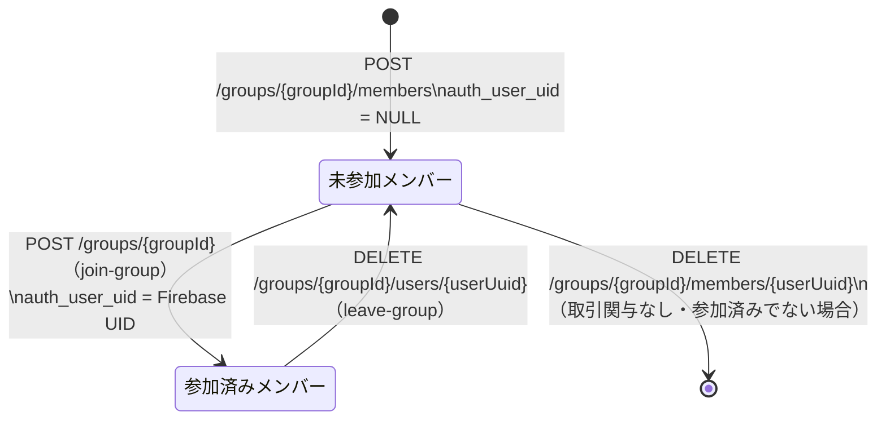

# Design Document (HLD) — group-member

## Step 2 Scope and Ownership Rules

- `design.md` は QA が E2E テストを記述するための唯一の HLD 情報源である。すべての主要フローノードは MySQL の変化と変化しない項目を明記する。
- QA ツールエンベロープ: HTTP クライアント（`restClient`）、DB クライアント（`dbClient`）、ステージング環境。外部依存なし。
- QA が担当するブランチ: QA ツールエンベロープで再現可能なブランチ（正常追加・正常削除・グループサイズ上限・認可・リソース不存在・削除制限）はすべて QA マトリクスに配置する。
- 開発者専用ブランチ: `users` INSERT と `user_groups` INSERT のアトミック性検証など内部失敗注入が必要なブランチは開発者マトリクスに移動する。
- 共有シナリオルール: 共有ビジネスシナリオは1回だけ定義し、QA E2E（ステージング）と開発者 Testcontainers ローカルで再利用する。
- QA は `GM-S01..GM-S08` を所有する。開発者専用具体的シナリオは `GM-S09` から続ける。

## Test Asset Shape

- 共有シナリオセット: `AddMemberScenariosTests`（interface、add-member 3層構造で実装済み）/ `RemoveMemberScenariosTests`（interface、別 PR で3層構造化予定）
- QA 自己サービス E2E スイート: E2E executor（ステージング用、別 PR で対応）
- 開発者ローカルセーフティネット: `AddMemberTestcontainersTest`（Testcontainers + MockMvc）/ `RemoveMemberScenarioTest`（旧形式）、`GroupServiceUnitTest`、`GroupServiceIntegrationTest`、`GroupServiceImplRemoveMemberTest`

## AC Ownership Matrix

| Requirement / AC | Business trigger | Primary owner repo | Verification entrypoint | Contract / interface | Test owner |
|------------------|------------------|--------------------|-------------------------|----------------------|------------|
| R1-AC1 | 認証済みメンバーがメンバー追加 | tateca-backend | `POST /groups/{groupId}/members` | `groups-groupId-members.yaml` | tateca-backend |
| R1-AC2 | 追加後にグループ情報確認（未参加メンバー） | tateca-backend | `GET /groups/{groupId}` | `groups-groupId-members.yaml` | tateca-backend |
| R1-AC3 | 追加後にメンバー数確認（+1） | tateca-backend | `GET /groups/{groupId}` | `groups-groupId-members.yaml` | tateca-backend |
| R1-AC4 | 同名メンバーが存在する状態で同名追加 | tateca-backend | `POST /groups/{groupId}/members` | `groups-groupId-members.yaml` | tateca-backend |
| R2-AC1 | 不正入力でメンバー追加 | tateca-backend | `POST /groups/{groupId}/members` 400 | `groups-groupId-members.yaml` | tateca-backend |
| R3-AC1 | グループが10名のときにメンバー追加 | tateca-backend | `POST /groups/{groupId}/members` 409 | `groups-groupId-members.yaml` | tateca-backend |
| R4-AC1 | グループ外ユーザーがメンバー追加・削除 | tateca-backend | 各エンドポイント 403 | 各 yaml | tateca-backend |
| R5-AC1 | 存在しないグループにメンバー追加 | tateca-backend | `POST /groups/{groupId}/members` 404 | `groups-groupId-members.yaml` | tateca-backend |
| R5-AC2 | 存在しないメンバーを削除 | tateca-backend | `DELETE /groups/{groupId}/members/{userUuid}` 404 | `groups-groupId-members-userUuid.yaml` | tateca-backend |
| R5-AC3 | 存在しないグループのメンバーを削除 | tateca-backend | `DELETE /groups/{groupId}/members/{userUuid}` 404 | `groups-groupId-members-userUuid.yaml` | tateca-backend |
| R6-AC1〜R6-AC3 | 未参加メンバーの正常削除 | tateca-backend | `DELETE /groups/{groupId}/members/{userUuid}` | `groups-groupId-members-userUuid.yaml` | tateca-backend |
| R7-AC1 | 参加済みメンバーの削除試行 | tateca-backend | `DELETE /groups/{groupId}/members/{userUuid}` 409 | `groups-groupId-members-userUuid.yaml` | tateca-backend |
| R8-AC1 | 取引関与メンバーの削除試行 | tateca-backend | `DELETE /groups/{groupId}/members/{userUuid}` 409 | `groups-groupId-members-userUuid.yaml` | tateca-backend |
| R9-AC1 | 不正入力でメンバー削除 | tateca-backend | `DELETE /groups/{groupId}/members/{userUuid}` 400 | `groups-groupId-members-userUuid.yaml` | tateca-backend |

## Contract Dependency Order and Step Routing

1. tateca-backend が `contracts/paths/groups-groupId-members.yaml` / `groups-groupId-members-userUuid.yaml` を所有し固定する
2. Step 3 (black-box tests) オーナー: tateca-backend（`AddMemberScenariosTests` / `RemoveMemberScenariosTests`、`GroupControllerWebTest`）
3. Step 4 (internal tests) オーナー: tateca-backend（`GroupServiceUnitTest`、`GroupServiceIntegrationTest`、`GroupServiceImplRemoveMemberTest`）

## Canonical Testable Flows

### POST /groups/{groupId}/members — メンバー追加フロー

Convention: HTTP status codes appear only on terminal response nodes. Intermediate nodes describe DB side effects only.

```mermaid
flowchart TD
    A([POST /groups/{groupId}/members]) --> B[Step1: DTO deserialize + Bean Validation\nMySQL: no write]
    B -->|invalid| T400[400 VALIDATION.FAILED\nerrors array 存在]
    B -->|Content-Type 不正| T415[415 REQUEST.UNSUPPORTED_MEDIA_TYPE]
    B -->|認証エラー| T401[401 AUTH.*]
    B -->|valid + 認証済み| C[Step2: findByGroupUuidWithUserDetails\nMySQL: SELECT user_groups JOIN users WHERE group_uuid=groupId]
    C -->|0件| T404[404 GROUP.NOT_FOUND]
    C -->|1件以上| D{認可チェック\n要求者の uid が\n認証済みメンバーに存在?}
    D -->|not member| T403[403 USER.NOT_GROUP_MEMBER]
    D -->|member| E{グループサイズチェック\nuser_groups.size >= 10?}
    E -->|上限到達| T409[409 GROUP.MAX_SIZE_REACHED]
    E -->|上限未満| F[Step3: UserEntity build + save\nMySQL: INSERT INTO users\n  uuid=new, name=member_name, auth_user_uid=NULL]
    F --> G[Step4: UserGroupEntity build + save\nMySQL: INSERT INTO user_groups\n  user_uuid=new, group_uuid=groupId]
    G --> T200[200 OK\nGroupResponse — 全メンバー + グループ情報 + transaction_count]
```

**Non-gate note:** 同名メンバーの重複チェックは存在しない。同名メンバーの追加は常に許可される（R1-AC4）。

### DELETE /groups/{groupId}/members/{userUuid} — メンバー削除フロー

Convention: HTTP status codes appear only on terminal response nodes. Intermediate nodes describe DB side effects only.

```mermaid
flowchart TD
    A([DELETE /groups/{groupId}/members/{userUuid}]) --> B[Step1: パスパラメータ Bean Validation\nMySQL: no write]
    B -->|UUID 形式不正| T400[400 VALIDATION.FAILED]
    B -->|認証エラー| T401[401 AUTH.*]
    B -->|valid + 認証済み| C[Step2: findByGroupUuidWithUserDetails\nMySQL: SELECT user_groups JOIN users WHERE group_uuid=groupId]
    C -->|0件| T404G[404 GROUP.NOT_FOUND]
    C -->|1件以上| D{認可チェック\n要求者の uid が\n認証済みメンバーに存在?}
    D -->|not member| T403[403 USER.NOT_GROUP_MEMBER]
    D -->|member| E{対象メンバー存在チェック\nuserUuid が user_groups に存在?}
    E -->|not found| T404U[404 USER.NOT_FOUND]
    E -->|found| F{参加済みチェック\ntargetUser.authUser != null?}
    F -->|参加済み| T409A[409 MEMBER.ALREADY_JOINED]
    F -->|未参加| G{取引関与チェック\npayer or obligation に存在?}
    G -->|関与あり| T409B[409 MEMBER.HAS_TRANSACTIONS]
    G -->|関与なし| H[Step3: delete userGroupEntity\nMySQL: DELETE FROM user_groups WHERE user_uuid=userUuid AND group_uuid=groupId]
    H --> I[Step4: delete userEntity\nMySQL: DELETE FROM users WHERE uuid=userUuid]
    I --> T204[204 No Content]
```

## External Integration Flows

本フィーチャーは外部 API 呼び出しを行わない。MySQL（`users` / `user_groups` / `transactions` / `obligations` テーブル）のみを使用する。

## State Model



## Assertion Rules For Test Authors

- **未参加メンバーの定義:** 追加されたメンバーの `users.auth_user_uid` は NULL でなければならない。レスポンス上では `UserResponse.auth_user` フィールドが null になる。
- **Step3 と Step4 のアトミック性:** `users` DELETE と `user_groups` DELETE は同一 `@Transactional` スコープで実行される。どちらか一方が失敗した場合、両方がロールバックされる（ただし、`users` INSERT + `user_groups` INSERT も同様）。
- **グループ不存在の判定:** `user_groups` テーブルが指定 `groupId` に対して0件 → `GROUP.NOT_FOUND`（add-member と remove-member 共通）。
- **認可チェック:** `users.auth_user_uid == uid` が `user_groups` に存在するメンバーのみが操作を許可される。未参加メンバー（`auth_user_uid = NULL`）は認可チェックを通過できない。
- **グループサイズカウント:** `user_groups.count(group_uuid = groupId)`。認証済みメンバーと未参加メンバーの両方がカウントに含まれる。
- **削除の物理削除:** `remove-member` は `user_groups` と `users` レコードを物理削除する。`leave-group`（`auth_user_uid = NULL` にセットのみ）とは異なる。
- **取引関与チェック:** `transactionRepository.existsByPayer(targetUser)` または `obligationRepository.existsByUser(targetUser)` が true の場合 `MEMBER.HAS_TRANSACTIONS`。
- **外部→内部エラー変換:** `GlobalExceptionHandler` が各例外を HTTP status + error_code にマッピングする。`GroupControllerWebTest` で証明する。
- **post-success rollback:** 外部 API なし。該当なし。
- **versioned-row:** `users` / `user_groups` テーブルに `version` カラムなし。

## QA E2E Matrix

| QA E2E method | Source | Staging prerequisite or harness | Response checks | MySQL checks |
|---------------|--------|--------------------------------|-----------------|--------------|
| `amS01_r1Ac1_addedMemberAppearsInGroup` | GM-S01 / R1-AC1 | 認証済みメンバーが存在するグループ | `200` / レスポンスに新メンバー存在 | `users` INSERT（auth_user_uid=NULL）/ `user_groups` INSERT |
| `amS02_r1Ac2_addedMemberIsUnjoined` | GM-S02 / R1-AC2 | 同上 | `200` / 追加メンバーの `auth_user == null` | `users.auth_user_uid IS NULL` |
| `amS03_r1Ac3_memberCountIncreasedByOne` | GM-S03 / R1-AC3 | 同上 | `200` / `$.users` 配列が追加前+1 | `user_groups` +1件 |
| `amS04_r1Ac4_duplicateNameAllowed` | GM-S04 / R1-AC4 | 同名メンバーが存在するグループ | `200` / 同名が2件 | `users` に同名2件 |
| `amS05_r3Ac1_groupAtMaxSizeRejected` | GM-S05 / R3-AC1 | 10名のグループ | `409` / `$.error_code == "GROUP.MAX_SIZE_REACHED"` | no write |
| `rmS01_r6Ac1_removeMemberAndVerify` | GM-S06 / R6-AC1 | 未参加メンバーが存在するグループ | `204` | `users` DELETE / `user_groups` DELETE |
| `rmS02_r6Ac2Ac3_memberRemovedFromGroup` | GM-S07 / R6-AC2, R6-AC3 | 同上 | `204` / 削除後 GET でメンバー不在 / メンバー数-1 | `users` レコード消滅 |
| `rmS03_r7Ac1_rejectJoinedMember` | GM-S08 / R7-AC1 | 参加済みメンバーが存在するグループ | `409` / `$.error_code == "MEMBER.ALREADY_JOINED"` | no write |

## QA Contract E2E Matrix

| QA contract E2E method | Source | Staging prerequisite or harness | Response checks | MySQL checks |
|------------------------|--------|--------------------------------|-----------------|--------------|
| `shouldReturn400WhenMemberNameIsBlank` | R2-AC1 / `VALIDATION.FAILED` | 有効グループ | `400` / `$.error_code == "VALIDATION.FAILED"` / `$.errors` 存在 | no write |
| `shouldReturn403WhenNotGroupMemberOnAdd` | R4-AC1 / `USER.NOT_GROUP_MEMBER` | グループ外ユーザー | `403` / `$.error_code == "USER.NOT_GROUP_MEMBER"` | no write |
| `shouldReturn404WhenGroupNotFoundOnAdd` | R5-AC1 / `GROUP.NOT_FOUND` | 存在しない groupId | `404` / `$.error_code == "GROUP.NOT_FOUND"` | no write |
| `shouldReturn415WhenNoContentTypeOnAdd` | `REQUEST.UNSUPPORTED_MEDIA_TYPE` | なし | `415` / `$.error_code == "REQUEST.UNSUPPORTED_MEDIA_TYPE"` | no write |
| `shouldReturn403WhenNotGroupMemberOnRemove` | R4-AC1 / `USER.NOT_GROUP_MEMBER` | グループ外ユーザー | `403` / `$.error_code == "USER.NOT_GROUP_MEMBER"` | no write |
| `shouldReturn404WhenGroupNotFoundOnRemove` | R5-AC3 / `GROUP.NOT_FOUND` | 存在しない groupId | `404` / `$.error_code == "GROUP.NOT_FOUND"` | no write |
| `shouldReturn404WhenMemberNotFound` | R5-AC2 / `USER.NOT_FOUND` | グループ存在・メンバー不存在 | `404` / `$.error_code == "USER.NOT_FOUND"` | no write |
| `shouldReturn409WhenMemberHasTransactions` | R8-AC1 / `MEMBER.HAS_TRANSACTIONS` | 取引関与メンバー存在 | `409` / `$.error_code == "MEMBER.HAS_TRANSACTIONS"` | no write |

## Developer Verification Policy

### Shared Scenario Mirroring

QA E2E マトリクスが共有ビジネス動作の唯一の正規シナリオマトリクスである。QA が所有するすべての共有シナリオ（GM-S01..GM-S08）は Testcontainers + MockMvc を使用してローカルでも実行可能であり、同じレスポンス・MySQL アウトカムを証明しなければならない。

### Dev-Only Verification

| Scenario ID | Verification item | Why it is developer-owned | Expected local proof |
|-------------|-------------------|---------------------------|----------------------|
| GM-S09 | `users` INSERT + `user_groups` INSERT のアトミック性（ロールバック確認） | DB 障害注入が必要 | `GroupServiceIntegrationTest` |
| — | `GroupServiceImpl.addMember` / `removeMember` の各ブランチ例外スロー確認 | モック注入が必要 | `GroupServiceUnitTest` / `GroupServiceImplRemoveMemberTest` |
| — | 全 OpenAPI エラーコードのマッピング（`VALIDATION.FAILED` / `GROUP.NOT_FOUND` / `GROUP.MAX_SIZE_REACHED` / `USER.NOT_GROUP_MEMBER` / `MEMBER.ALREADY_JOINED` / `MEMBER.HAS_TRANSACTIONS` など） | ExceptionHandler マッピングは Controller Web Test で網羅 | `GroupControllerWebTest` |

### Local Proof Selection Rule

- **共有シナリオ（GM-S01..GM-S05）:** `AddMemberTestcontainersTest`（Testcontainers + MockMvc）
- **共有シナリオ（GM-S06..GM-S08）:** `RemoveMemberScenarioTest`（旧形式、Testcontainers + MockMvc）
- **コントラクト・バリデーション・エラーマッピング:** `GroupControllerWebTest`（`@WebMvcTest`）
- **ドメインロジック分岐:** `GroupServiceUnitTest` / `GroupServiceImplRemoveMemberTest`（Mockito）
- **DB 永続化・トランザクション境界:** `GroupServiceIntegrationTest`（Testcontainers）

## Data Model Decisions

- メンバー追加は `users` テーブルへの INSERT（`auth_user_uid = NULL`）+ `user_groups` テーブルへの INSERT を同一トランザクションで実行する。
- メンバー削除は `user_groups` と `users` を物理削除する。`leave-group`（`auth_user_uid = NULL`）とは異なり、レコード自体を削除する。
- `user_groups` は (`user_uuid`, `group_uuid`) 複合 PK を持つ。グループサイズカウントは `user_groups.count(group_uuid = groupId)` で行われ、認証済み・未参加を問わずカウントされる。
- `users.name` は `varchar(50)` で、文字数上限は Bean Validation（`@Size(max=50)`）と DB スキーマ制約の両方で保証される。一意制約なし。
