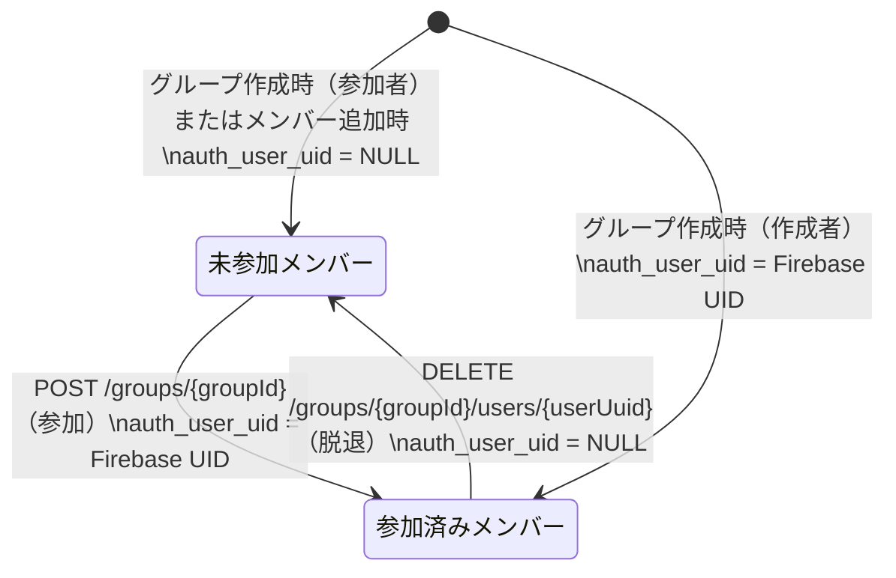

# Design Document (HLD) — group

## Step 2 Scope and Ownership Rules

- `design.md` は QA が E2E テストを記述するための唯一の HLD 情報源である。すべての主要フローノードは MySQL の変化と変化しない項目を明記する。
- QA ツールエンベロープ: HTTP クライアント（`restClient`）、DB クライアント（`dbClient`）、ステージング環境。外部依存なし（Firebase 認証はフィルター層担当）。
- QA が担当するブランチ: QA ツールエンベロープで再現可能なブランチ（正常作成・取得・一覧・名前更新・参加・脱退・各種バリデーション・エラー）はすべて QA マトリクスに配置する。
- 開発者専用ブランチ: 特権ユーザー免除ロジック（設定ファイル書き換えが必要）・JPA ライフサイクル検証など内部失敗注入が必要なブランチは開発者マトリクスに移動する。
- 共有シナリオルール: 共有ビジネスシナリオは1回だけ定義し、QA E2E（ステージング）と開発者 Testcontainers ローカルで再利用する。
- QA は `GR-S01..GR-S11` を所有する。開発者専用具体的シナリオは `GR-S12` から続ける。

## Test Asset Shape

- 共有シナリオセット: `GroupScenariosTests`（interface）— 現在は操作別 ScenarioTest（旧形式）が代替
- QA 自己サービス E2E スイート: E2E executor（ステージング用、別 PR で対応）
- 開発者ローカルセーフティネット: `CreateGroupScenarioTest` / `GetGroupDetailScenarioTest` / `GetGroupListScenarioTest` / `UpdateGroupNameScenarioTest` / `JoinGroupScenarioTest` / `LeaveGroupScenarioTest`（Testcontainers + MockMvc）、`GroupServiceUnitTest`、`GroupServiceIntegrationTest`

## AC Ownership Matrix

| Requirement / AC | Business trigger | Primary owner repo | Verification entrypoint | Contract / interface | Test owner |
|------------------|------------------|--------------------|-------------------------|----------------------|------------|
| R1-AC1 | グループ名・作成者名・参加者名でグループ作成 | tateca-backend | `POST /groups` | `groups.yaml` | tateca-backend |
| R1-AC2 | 作成後にグループ情報確認（作成者が認証済みメンバー） | tateca-backend | `GET /groups/{groupId}` | `groups.yaml` | tateca-backend |
| R1-AC3 | 作成後にグループ情報確認（参加者が未参加メンバー） | tateca-backend | `GET /groups/{groupId}` | `groups.yaml` | tateca-backend |
| R1-AC4 | 作成後にグループ情報確認（取引件数0件） | tateca-backend | `GET /groups/{groupId}` | `groups.yaml` | tateca-backend |
| R2-AC1 | 不正入力でグループ作成 | tateca-backend | `POST /groups` 400 | `groups.yaml` | tateca-backend |
| R3-AC1 | 9グループ参加済みでグループ作成・参加 | tateca-backend | `POST /groups` / `POST /groups/{groupId}` 409 | `groups.yaml` / `groups-groupId.yaml` | tateca-backend |
| R3-AC2 | 特権ユーザーがグループ参加上限超えで作成・参加 | tateca-backend | `POST /groups` / `POST /groups/{groupId}` 201/200 | `groups.yaml` / `groups-groupId.yaml` | tateca-backend |
| R4-AC1 | アカウント情報なしでグループ作成 | tateca-backend | `POST /groups` 404 | `groups.yaml` | tateca-backend |
| R5-AC1 | メンバー登録済みグループを取得 | tateca-backend | `GET /groups/{groupId}` | `groups-groupId.yaml` | tateca-backend |
| R5-AC2 | メンバー未登録グループを取得 | tateca-backend | `GET /groups/{groupId}` 404 | `groups-groupId.yaml` | tateca-backend |
| R6-AC1 | 不正入力で取得・更新・脱退 | tateca-backend | 各エンドポイント 400 | 各 yaml | tateca-backend |
| R7-AC1〜R7-AC7 | 各操作で存在しないリソースを指定 | tateca-backend | 各エンドポイント 404 | 各 yaml | tateca-backend |
| R8-AC1〜R8-AC3 | 認証済みユーザーのグループ一覧取得 | tateca-backend | `GET /groups/list` | `groups-list.yaml` | tateca-backend |
| R9-AC1〜R9-AC4 | グループ名更新 | tateca-backend | `PATCH /groups/{groupId}` | `groups-groupId.yaml` | tateca-backend |
| R10-AC1〜R10-AC2 | 招待トークンでグループ参加 | tateca-backend | `POST /groups/{groupId}` | `groups-groupId.yaml` | tateca-backend |
| R11-AC1〜R11-AC2 | 重複参加の防止 | tateca-backend | `POST /groups/{groupId}` 409 | `groups-groupId.yaml` | tateca-backend |
| R12-AC1 | 不正トークンでグループ参加 | tateca-backend | `POST /groups/{groupId}` 403 | `groups-groupId.yaml` | tateca-backend |
| R13-AC1〜R13-AC3 | グループ脱退 | tateca-backend | `DELETE /groups/{groupId}/users/{userUuid}` | `groups-groupId-users-userUuid.yaml` | tateca-backend |

## Contract Dependency Order and Step Routing

1. tateca-backend が `contracts/paths/groups.yaml` / `groups-groupId.yaml` / `groups-list.yaml` / `groups-groupId-users-userUuid.yaml` を所有し固定する
2. Step 3 (black-box tests) オーナー: tateca-backend（`GroupScenariosTests`、`GroupControllerWebTest`）
3. Step 4 (internal tests) オーナー: tateca-backend（`GroupServiceUnitTest`、`GroupServiceIntegrationTest`）

## Canonical Testable Flows

### POST /groups — グループ作成フロー

Convention: HTTP status codes appear only on terminal response nodes. Intermediate nodes describe DB side effects only.

```mermaid
flowchart TD
    A([POST /groups]) --> B[Step1: DTO deserialize + Bean Validation\nMySQL: no write]
    B -->|invalid| T400[400 VALIDATION.FAILED\nerrors array 存在]
    B -->|Content-Type 不正| T415[415 REQUEST.UNSUPPORTED_MEDIA_TYPE]
    B -->|認証エラー| T401[401 AUTH.*]
    B -->|valid + 認証済み| C[Step2: validateMaxGroupCount\nMySQL: SELECT users WHERE auth_user_uid=uid]
    C -->|9グループ以上 かつ 非特権ユーザー| T409A[409 USER.MAX_GROUP_COUNT_EXCEEDED]
    C -->|上限未満 or 特権ユーザー| D[Step3: findById uid\nMySQL: SELECT auth_users WHERE uid]
    D -->|not found| T404[404 AUTH_USER.NOT_FOUND]
    D -->|found| E[Step4: GroupEntity build + save\nMySQL: INSERT INTO groups\nuuid=new, name, join_token=new\ntokenExpires=now+1day, createdAt/updatedAt via @PrePersist]
    E --> F[Step5: UserEntity list build + saveAll\nMySQL: INSERT INTO users (creator: auth_user_uid=uid)\n       INSERT INTO users (participants: auth_user_uid=NULL)]
    F --> G[Step6: UserGroupEntity list + saveAll\nMySQL: INSERT INTO user_groups (creator + all participants)]
    G --> T201[201 Created\nGroupResponse — 全メンバー + グループ情報 + transaction_count=0]
```

### GET /groups/{groupId} — グループ詳細取得フロー

Convention: HTTP status codes appear only on terminal response nodes. Intermediate nodes describe DB side effects only.

```mermaid
flowchart TD
    A([GET /groups/{groupId}]) --> B[Step1: パスパラメータ Bean Validation\nMySQL: no write]
    B -->|UUID 形式不正| T400[400 VALIDATION.FAILED]
    B -->|認証エラー| T401[401 AUTH.*]
    B -->|valid + 認証済み| C[Step2: findByGroupUuidWithUserDetails\nMySQL: SELECT user_groups JOIN users WHERE group_uuid=groupId]
    C -->|0件（グループ不存在 or メンバーなし）| T404[404 GROUP.NOT_FOUND]
    C -->|1件以上| D[Step3: countByGroup_Uuid\nMySQL: SELECT COUNT(*) FROM transactions WHERE group_uuid=groupId\nMySQL: no write]
    D --> T200[200 OK\nGroupResponse — メンバー一覧 + グループ情報 + transaction_count]
```

### GET /groups/list — グループ一覧取得フロー

Convention: HTTP status codes appear only on terminal response nodes. Intermediate nodes describe DB side effects only.

```mermaid
flowchart TD
    A([GET /groups/list]) --> B[認証チェック\nMySQL: no write]
    B -->|認証エラー| T401[401 AUTH.*]
    B -->|認証済み| C[Step1: findByAuthUserUid\nMySQL: SELECT users WHERE auth_user_uid=uid]
    C -->|0件| T200E[200 OK\nGroupListResponse — group_list 空配列]
    C -->|1件以上| D[Step2: findByUserUuidListWithGroup\nMySQL: SELECT user_groups JOIN groups WHERE user_uuid IN (...)]
    D --> T200[200 OK\nGroupListResponse — 所属グループ一覧]
```

### PATCH /groups/{groupId} — グループ名更新フロー

Convention: HTTP status codes appear only on terminal response nodes. Intermediate nodes describe DB side effects only.

```mermaid
flowchart TD
    A([PATCH /groups/{groupId}]) --> B[Step1: DTO deserialize + Bean Validation\nMySQL: no write]
    B -->|invalid| T400[400 VALIDATION.FAILED]
    B -->|Content-Type 不正| T415[415 REQUEST.UNSUPPORTED_MEDIA_TYPE]
    B -->|認証エラー| T401[401 AUTH.*]
    B -->|valid + 認証済み| C[Step2: findById groupId\nMySQL: SELECT groups WHERE uuid=groupId]
    C -->|not found| T404[404 GROUP.NOT_FOUND]
    C -->|found| D[Step3: setName + save\nMySQL: UPDATE groups SET name, updated_at via @PreUpdate]
    D --> E[Step4: getGroupInfo（レスポンス構築）\nMySQL: SELECT user_groups JOIN users, COUNT transactions]
    E --> T200[200 OK\nGroupResponse — 更新後グループ情報]
```

### POST /groups/{groupId} — グループ参加フロー

Convention: HTTP status codes appear only on terminal response nodes. Intermediate nodes describe DB side effects only.

```mermaid
flowchart TD
    A([POST /groups/{groupId}]) --> B[Step1: DTO deserialize + Bean Validation\nMySQL: no write]
    B -->|invalid| T400[400 VALIDATION.FAILED]
    B -->|Content-Type 不正| T415[415 REQUEST.UNSUPPORTED_MEDIA_TYPE]
    B -->|認証エラー| T401[401 AUTH.*]
    B -->|valid + 認証済み| C[Step2: findById groupId\nMySQL: SELECT groups WHERE uuid=groupId]
    C -->|not found| T404G[404 GROUP.NOT_FOUND]
    C -->|found| D[Step3: findByGroupUuidWithUserDetails\nMySQL: SELECT user_groups JOIN users]
    D --> E{重複参加チェック\nauth_user.uid == uid のメンバーが存在?}
    E -->|already joined| T409A[409 GROUP.ALREADY_JOINED]
    E -->|not joined| F[Step4: validateMaxGroupCount\nMySQL: SELECT users WHERE auth_user_uid=uid]
    F -->|9グループ以上 かつ 非特権ユーザー| T409B[409 USER.MAX_GROUP_COUNT_EXCEEDED]
    F -->|上限未満 or 特権ユーザー| G{トークン検証\nrequest.joinToken == group.joinToken?}
    G -->|mismatch| T403[403 GROUP.INVALID_JOIN_TOKEN]
    G -->|match| H[Step5: findById userUuid\nMySQL: SELECT users WHERE uuid=userUuid]
    H -->|not found| T404U[404 USER.NOT_FOUND]
    H -->|found| I[Step6: findById uid (auth_user)\nMySQL: SELECT auth_users WHERE uid]
    I -->|not found| T404AU[404 AUTH_USER.NOT_FOUND]
    I -->|found| J[Step7: setAuthUser + save\nMySQL: UPDATE users SET auth_user_uid=uid]
    J --> T200[200 OK\nGroupResponse — 参加後グループ情報]
```

### DELETE /groups/{groupId}/users/{userUuid} — グループ脱退フロー

Convention: HTTP status codes appear only on terminal response nodes. Intermediate nodes describe DB side effects only.

```mermaid
flowchart TD
    A([DELETE /groups/{groupId}/users/{userUuid}]) --> B[Step1: パスパラメータ Bean Validation\nMySQL: no write]
    B -->|UUID 形式不正| T400[400 VALIDATION.FAILED]
    B -->|認証エラー| T401[401 AUTH.*]
    B -->|valid + 認証済み| C[Step2: findById groupId\nMySQL: SELECT groups WHERE uuid=groupId]
    C -->|not found| T404G[404 GROUP.NOT_FOUND]
    C -->|found| D[Step3: findByUserUuidAndGroupUuid\nMySQL: SELECT user_groups WHERE user_uuid=userUuid AND group_uuid=groupId]
    D -->|not found| T404UG[404 USER.NOT_IN_GROUP]
    D -->|found| E[Step4: findById userUuid\nMySQL: SELECT users WHERE uuid=userUuid]
    E -->|not found| T404U[404 USER.NOT_FOUND]
    E -->|found| F[Step5: setAuthUser null + save\nMySQL: UPDATE users SET auth_user_uid=NULL]
    F --> T204[204 No Content]
```

**Non-gate notes:**
- `updateGroupName` と `getGroupInfo` には認可チェック（グループメンバーであること）が存在しない。認証済みであれば任意のグループを操作可能。
- `leaveGroup` には要求者と脱退対象の同一性検証が存在しない。認証済みであれば任意のメンバーの紐付けを解除可能。
- `joinGroupInvited` のトークン有効期限チェックは実装されていない（`tokenExpires` フィールドは存在するが参照されない）。

## External Integration Flows

本フィーチャーは外部 API 呼び出しを行わない。Firebase 認証は `TatecaAuthenticationFilter`（リクエストフィルター）が担当し、`GroupServiceImpl` は呼ばない。MySQL（`groups` / `users` / `user_groups` / `transactions` テーブル）のみを使用する。

## State Model



グループ自体のライフサイクル状態はない（削除機能は Out of Scope）。

## Assertion Rules For Test Authors

- **グループ作成初期値:** `join_token` = `UUID.randomUUID()`、`token_expires` = `now + 1 day`、`created_at` / `updated_at` = `@PrePersist` で自動設定。`transaction_count` = 0（トランザクションレコードなし）。
- **作成者と参加者の区別:** 作成者の `users.auth_user_uid` = 要求者の UID。参加者の `users.auth_user_uid` = NULL（未参加メンバー）。
- **グループ参加上限:** `userRepository.findByAuthUserUid(uid).size() >= 9` のとき上限到達。特権ユーザー（`businessRuleConfig.getUnlimitedGroupUid()` と一致する UID）は免除。
- **グループ詳細取得の GROUP_NOT_FOUND 条件:** `user_groups` テーブルが指定 `groupId` に対して0件 → `GROUP.NOT_FOUND`。グループが存在してもメンバーが0件の状態は現在の実装では不可能のため、この条件はグループ不存在と等価。
- **グループ名更新の非変更属性:** `join_token`・`token_expires`・`created_at` は変更されない。`updated_at` は `@PreUpdate` で更新される。
- **脱退後の再参加:** `users.auth_user_uid` が NULL に戻るため、`joinGroupInvited` で再度招待トークンを使って参加可能。
- **`@PreUpdate`:** `groupRepository.save()` 時に JPA `@PreUpdate` が `updated_at = Instant.now()` を設定する。`AuthUserServiceIntegrationTest` 相当のテストで証明する。
- **外部→内部エラー変換:** `GlobalExceptionHandler` が各例外を HTTP status + error_code にマッピングする。`GroupControllerWebTest` で証明する。
- **post-success rollback:** 外部 API なし。該当なし。
- **versioned-row:** `groups` / `users` / `user_groups` テーブルに `version` カラムなし。

## QA E2E Matrix

| QA E2E method | Source | Staging prerequisite or harness | Response checks | MySQL checks |
|---------------|--------|--------------------------------|-----------------|--------------|
| `grS01_r1Ac1_createGroupAndVerify` | GR-S01 / R1-AC1 | 認証ユーザー作成済み | `201` / `$.group.uuid` 存在 / `$.group.join_token` 存在 | `groups` レコード INSERT |
| `grS02_r1Ac2Ac3Ac4_initialState` | GR-S02 / R1-AC2, R1-AC3, R1-AC4 | 認証ユーザー作成済み | `201` / 作成者が `auth_user` 非 null / 参加者が `auth_user` null / `transaction_count == 0` | `users` に creator（auth_user_uid=uid）と participants（auth_user_uid=NULL） |
| `grS03_r5Ac1_getGroupDetail` | GR-S03 / R5-AC1 | グループ作成済み | `200` / `$.users` 存在 / `$.transaction_count` 数値 | — |
| `grS04_r8Ac1Ac2Ac3_getGroupList` | GR-S04 / R8-AC1, R8-AC2, R8-AC3 | 複数グループ参加済み・脱退済みグループあり | `200` / 所属グループのみ / 脱退済みは除外 | — |
| `grS05_r9Ac1Ac2_updateGroupName` | GR-S05 / R9-AC1, R9-AC2 | グループ作成済み | `200` / `$.group.name == "NewName"` | `groups.name == "NewName"` |
| `grS06_r9Ac3Ac4_unchangedAttributes` | GR-S06 / R9-AC3, R9-AC4 | グループ作成済み | `200` / `join_token` 変化なし / `updated_at` 更新済み | `groups.join_token` 変化なし / `groups.updated_at` 更新 |
| `grS07_r10Ac1Ac2_joinGroup` | GR-S07 / R10-AC1, R10-AC2 | グループ作成済み・未参加メンバー存在 | `200` / 参加メンバーの `auth_user` 非 null | `users.auth_user_uid == uid` |
| `grS08_r13Ac1Ac2_leaveGroup` | GR-S08 / R13-AC1, R13-AC2 | グループ参加済み | `204` / 脱退後 GET で当該メンバーの `auth_user == null` | `users.auth_user_uid == NULL` |
| `grS09_r13Ac3_rejoinAfterLeave` | GR-S09 / R13-AC3 | グループ脱退済み | 再参加で `200` / メンバーの `auth_user` 非 null | `users.auth_user_uid == uid` |
| `grS10_r3Ac1_rejectMaxGroupCount` | GR-S10 / R3-AC1 | 9グループ参加済み | `409` / `$.error_code == "USER.MAX_GROUP_COUNT_EXCEEDED"` | no write |
| `grS11_r11Ac1Ac2_rejectDuplicateJoin` | GR-S11 / R11-AC1, R11-AC2 | グループ参加済み | `409` / `$.error_code == "GROUP.ALREADY_JOINED"` | no write |

## QA Contract E2E Matrix

| QA contract E2E method | Source | Staging prerequisite or harness | Response checks | MySQL checks |
|------------------------|--------|--------------------------------|-----------------|--------------|
| `shouldReturn400WhenCreateGroupInvalidInput` | R2-AC1 / `VALIDATION.FAILED` | なし | `400` / `$.error_code == "VALIDATION.FAILED"` | no write |
| `shouldReturn415WhenCreateGroupNoContentType` | `REQUEST.UNSUPPORTED_MEDIA_TYPE` | なし | `415` / `$.error_code == "REQUEST.UNSUPPORTED_MEDIA_TYPE"` | no write |
| `shouldReturn404WhenCreateGroupAuthUserNotFound` | R4-AC1 / `AUTH_USER.NOT_FOUND` | アカウント情報なし | `404` / `$.error_code == "AUTH_USER.NOT_FOUND"` | no write |
| `shouldReturn404WhenGetGroupNotFound` | R7-AC1 / `GROUP.NOT_FOUND` | なし | `404` / `$.error_code == "GROUP.NOT_FOUND"` | no write |
| `shouldReturn400WhenGetGroupInvalidUuid` | R6-AC1 / `VALIDATION.FAILED` | なし | `400` | no write |
| `shouldReturn400WhenUpdateGroupNameInvalidInput` | R6-AC1 / `VALIDATION.FAILED` | なし | `400` / `$.error_code == "VALIDATION.FAILED"` | no write |
| `shouldReturn404WhenUpdateGroupNameNotFound` | R7-AC2 / `GROUP.NOT_FOUND` | なし | `404` / `$.error_code == "GROUP.NOT_FOUND"` | no write |
| `shouldReturn403WhenJoinGroupInvalidToken` | R12-AC1 / `GROUP.INVALID_JOIN_TOKEN` | グループ作成済み | `403` / `$.error_code == "GROUP.INVALID_JOIN_TOKEN"` | no write |
| `shouldReturn404WhenJoinGroupNotFound` | R7-AC5 / `GROUP.NOT_FOUND` | なし | `404` / `$.error_code == "GROUP.NOT_FOUND"` | no write |
| `shouldReturn409WhenJoinGroupAlreadyJoined` | R11-AC1 / `GROUP.ALREADY_JOINED` | 参加済み | `409` / `$.error_code == "GROUP.ALREADY_JOINED"` | no write |
| `shouldReturn409WhenJoinGroupMaxCount` | R3-AC1 / `USER.MAX_GROUP_COUNT_EXCEEDED` | 9グループ参加済み | `409` / `$.error_code == "USER.MAX_GROUP_COUNT_EXCEEDED"` | no write |
| `shouldReturn404WhenLeaveGroupNotFound` | R7-AC3 / `GROUP.NOT_FOUND` | なし | `404` / `$.error_code == "GROUP.NOT_FOUND"` | no write |
| `shouldReturn404WhenLeaveGroupUserNotInGroup` | R7-AC4 / `USER.NOT_IN_GROUP` | グループ作成済み | `404` / `$.error_code == "USER.NOT_IN_GROUP"` | no write |

## Developer Verification Policy

### Shared Scenario Mirroring

QA E2E マトリクスが共有ビジネス動作の唯一の正規シナリオマトリクスである。QA が所有するすべての共有シナリオ（GR-S01..GR-S11）は Testcontainers + MockMvc を使用してローカルでも実行可能であり、同じレスポンス・MySQL アウトカムを証明しなければならない。

### Dev-Only Verification

| Scenario ID | Verification item | Why it is developer-owned | Expected local proof |
|-------------|-------------------|---------------------------|----------------------|
| GR-S12 | 特権ユーザーがグループ参加上限を超えて作成・参加できること | `businessRuleConfig.getUnlimitedGroupUid()` の設定書き換えが必要 | `GroupServiceUnitTest` |
| — | JPA `@PrePersist` が `groups.createdAt` / `updatedAt` / `tokenExpires` を設定すること | 実 DB・JPA ライフサイクルが必要 | `GroupServiceIntegrationTest` |
| — | JPA `@PreUpdate` が `groups.updatedAt` を更新すること（グループ名更新時） | 実 DB・JPA ライフサイクルが必要 | `GroupServiceIntegrationTest` |
| — | `GroupServiceImpl` 各メソッドの分岐（NOT_FOUND・MAX_COUNT・ALREADY_JOINED・INVALID_TOKEN など）の例外スロー確認 | モック注入が必要 | `GroupServiceUnitTest` |
| — | 全 OpenAPI エラーコードのマッピング（`VALIDATION.FAILED` / `GROUP.NOT_FOUND` / `GROUP.ALREADY_JOINED` / `USER.MAX_GROUP_COUNT_EXCEEDED` / `GROUP.INVALID_JOIN_TOKEN` など） | ExceptionHandler マッピングは Controller Web Test で網羅 | `GroupControllerWebTest` |

### Local Proof Selection Rule

- **共有シナリオ（GR-S01..GR-S11）:** 操作別 ScenarioTest（Testcontainers + MockMvc）
- **コントラクト・バリデーション・エラーマッピング:** `GroupControllerWebTest`（`@WebMvcTest`）
- **ドメインロジック分岐:** `GroupServiceUnitTest`（Mockito）
- **DB 永続化・JPA ライフサイクル:** `GroupServiceIntegrationTest`（Testcontainers）

## Data Model Decisions

- `groups` テーブル: `uuid`（PK）/ `name`（varchar(50)）/ `join_token`（BINARY(16)）/ `token_expires`（Instant, @PrePersist で now+1day 設定）/ `created_at` / `updated_at`（@PrePersist / @PreUpdate）
- `users` テーブル: `uuid`（PK）/ `name`（varchar(50)）/ `auth_user_uid`（FK to auth_users, nullable）— `auth_user_uid = NULL` が未参加メンバーを表現
- `user_groups` テーブル: (`user_uuid`, `group_uuid`) 複合 PK — 同一ユーザーの同一グループへの重複参加を DB レベルで防止
- グループ名の一意制約なし（同名グループ許容）。参加者名の一意制約なし（同名メンバー許容）。
- 脱退は `users.auth_user_uid = NULL` にセットするのみでレコードを保持する。再参加は `joinGroupInvited` で再度 UID をセットすることで実現する。
- `token_expires` フィールドは存在するが、`joinGroupInvited` では参照されない（有効期限チェックは Out of Scope）。
